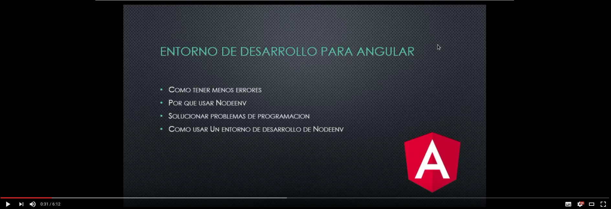

# angular-cli-env
ambiente de desarrollo de angular cli

# comando de creacion de ambiente de desarrollo #

sh create-env.sh

# comando de activacion de ambiente de desarrollo #

source aenv/bin/activate

# comando de instalacion de ambiente de desarrollo #

sh install-env.sh

# comando de desactivacion de ambiente de desarrollo #

deactivate_node

# Video de uso de este repo #

